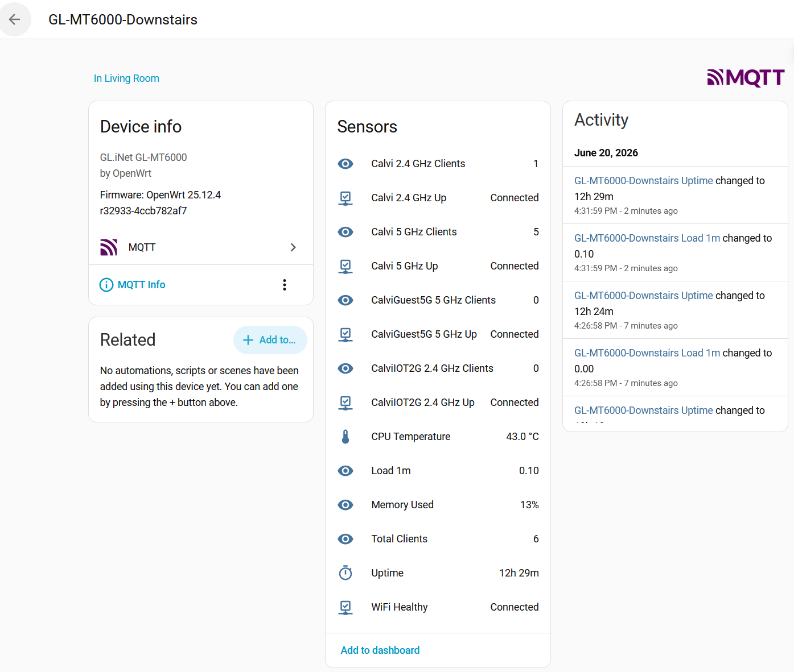

# openwrt-mqtt-haos

Publishes OpenWrt router stats to Home Assistant via MQTT discovery.

Tested on GL-MT6000 running Alpine-based OpenWrt.

## Screenshot



## Overview

This script runs as a background daemon on your OpenWrt router and publishes WiFi and system stats to an MQTT broker. Home Assistant auto-discovers all sensors via MQTT discovery — no manual sensor configuration needed.

It uses two publish speeds:
- **Fast (default 60s)** — client counts and WiFi up/down status, published whenever something changes
- **Slow (default 300s)** — CPU temperature, memory usage, load average and uptime, published on a heartbeat timer

Change detection is used for fast state — if nothing changes, nothing is published.

---

## Sensors

| Sensor | Topic | Update rate |
|--------|-------|-------------|
| Per-SSID client count | `openwrt/{id}/ssid/{ssid}/state` | Fast (60s) |
| Per-SSID up/down | `openwrt/{id}/ssid/{ssid}/state` | Fast (60s) |
| Total clients | `openwrt/{id}/state` | Fast (60s) |
| WiFi Healthy | `openwrt/{id}/state` | Fast (60s) |
| CPU Temperature | `openwrt/{id}/slow_state` | Slow (300s) |
| Memory Used % | `openwrt/{id}/slow_state` | Slow (300s) |
| Load 1m | `openwrt/{id}/slow_state` | Slow (300s) |
| Uptime | `openwrt/{id}/slow_state` | Slow (300s) |

Uptime displays as:
- `2m 34s` — under 1 hour
- `3h 12m` — under 1 day
- `6d 11h` — 1 day or more

SSIDs are auto-detected from `iw dev` at discovery time. Each SSID gets its own pair of sensors (clients + up/down). The device ID is derived from the router hostname.

---

## Requirements

- OpenWrt (Alpine/apk-based, 23.05+)
- `mosquitto-client-nossl` — installed automatically by the script
- `iw` — included in OpenWrt by default
- `uci` — included in OpenWrt by default
- Home Assistant with the MQTT integration enabled and a broker (e.g. Mosquitto add-on)

---

## Install

```sh
# Download the script to the router
wget -O /root/openwrt_mqtt.sh https://raw.githubusercontent.com/JCalvi/openwrt-mqtt-haos/main/openwrt_mqtt.sh
chmod +x /root/openwrt_mqtt.sh

# Run the installer
/root/openwrt_mqtt.sh install
```

The installer will:
1. Auto-install `mosquitto-client-nossl` via `apk` if not already present
2. Prompt for MQTT configuration, showing defaults in brackets — press Enter to accept
3. Write config to `/etc/config/openwrt_mqtt` via UCI
4. Install and enable a procd init service at `/etc/init.d/openwrt_mqtt`
5. Publish MQTT discovery payloads so Home Assistant registers all sensors
6. Publish initial state immediately (no waiting for the first poll cycle)
7. Start the daemon

---

## Configuration

Config is stored in `/etc/config/openwrt_mqtt` and managed via UCI:

```
config mqtt
        option host '192.168.1.20'
        option user 'openwrt'
        option password 'yourpassword'
        option discovery_prefix 'homeassistant'
        option poll_interval '60'
        option heartbeat '300'
```

| Option | Description | Default |
|--------|-------------|---------|
| `host` | MQTT broker IP or hostname | `192.168.1.20` |
| `user` | MQTT username | `openwrt` |
| `password` | MQTT password | _(empty)_ |
| `discovery_prefix` | Home Assistant MQTT discovery prefix | `homeassistant` |
| `poll_interval` | Seconds between fast state checks (clients, WiFi) | `60` |
| `heartbeat` | Seconds between slow state publishes (temp, memory, load, uptime) | `300` |

You can edit the config directly with UCI:

```sh
uci set openwrt_mqtt.@mqtt[0].host='192.168.1.5'
uci commit openwrt_mqtt
```

Config changes are picked up automatically on the next poll cycle — no restart needed.

To re-run the interactive config prompts at any time:

```sh
/root/openwrt_mqtt.sh install
```

Re-running install is safe — it pre-fills all prompts with current values so you can just change what you need.

---

## Service

The script installs itself as a procd init service that starts automatically on boot and restarts if it crashes.

```sh
# Start / stop / restart
/etc/init.d/openwrt_mqtt start
/etc/init.d/openwrt_mqtt stop
/etc/init.d/openwrt_mqtt restart

# Enable / disable on boot
/etc/init.d/openwrt_mqtt enable
/etc/init.d/openwrt_mqtt disable
```

The service runs `/root/openwrt_mqtt.sh daemon` which loops indefinitely, sleeping for `poll_interval` seconds between publishes.

Logs are available via:

```sh
logread | grep openwrt_mqtt
```

---

## Commands

| Command | Description |
|---------|-------------|
| `install` | Full install: deps, config, service, discovery, publish |
| `discovery` | Re-publish MQTT discovery payloads (run after adding a new SSID) |
| `publish` | Publish current state once and exit |
| `daemon` | Run as a continuous polling daemon (used by the service) |
| `status` | Show current config, detected SSIDs, and live state |
| `version` | Print version number |

### Re-running discovery

If you add a new SSID or change your network setup, re-run discovery to register the new sensors in Home Assistant:

```sh
/root/openwrt_mqtt.sh discovery
```

### Checking status

```sh
/root/openwrt_mqtt.sh status
```

This shows the current config, all detected SSIDs, and the last fast/slow state payloads without publishing anything.

---

## MQTT Topics

| Topic | Contents |
|-------|----------|
| `openwrt/{device_id}/availability` | `online` / `offline` |
| `openwrt/{device_id}/state` | `{"healthy": true, "clients_total": 24}` |
| `openwrt/{device_id}/slow_state` | `{"uptime": 12345, "load1": "0.09", "memory_used_pct": 14, "cpu_temp": 43}` |
| `openwrt/{device_id}/ssid/{ssid_id}/state` | `{"ssid": "MyWiFi", "band": "24", "ifname": "phy0-ap0", "up": true, "clients": 18}` |

`{device_id}` is the router hostname converted to lowercase with special characters replaced by hyphens (e.g. `GL-MT6000-Upstairs` → `gl-mt6000-upstairs`).

---

## Uninstall

```sh
/etc/init.d/openwrt_mqtt stop
/etc/init.d/openwrt_mqtt disable
rm /etc/init.d/openwrt_mqtt
rm /root/openwrt_mqtt.sh
uci delete openwrt_mqtt.@mqtt[0]
uci commit openwrt_mqtt
rm /etc/config/openwrt_mqtt
```
